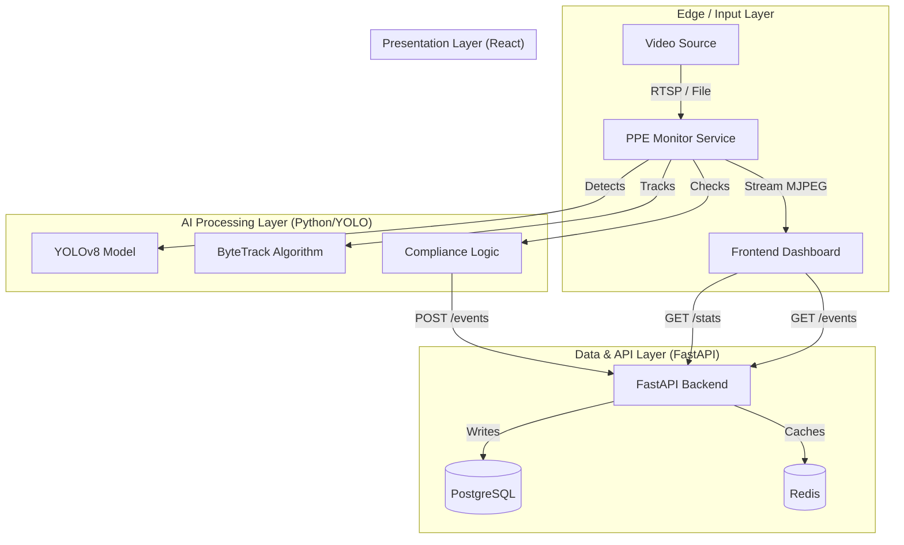

# Aegis Safety Platform - System Architecture

This document outlines the technical architecture of the Aegis Industrial Safety Platform.

## High-Level Data Flow

## Component Details

### 1. PPE Monitor Service (`/ppe_monitor`)
*   **Role**: The "Eyes" of the system.
*   **Tech Stack**: Python, OpenCV, Ultralytics YOLOv8, Supervision.
*   **Key Responsibilities**:
    *   Ingest video frames (from file `test_video.mp4` or RTSP camera).
    *   **Detection**: Uses YOLOv8 (GPU-accelerated) to find Persons and PPE.
    *   **Tracking**: Uses ByteTrack to assign unique IDs to each worker.
    *   **Compliance**: Checks if mapped ID has required gear (Helmet/Vest).
    *   **Reporting**: Sends JSON alerts to Backend API.
    *   **Streaming**: Serves a low-latency MJPEG video feed to the frontend.

### 2. Backend Service (`/backend`)
*   **Role**: The "Brain" and storage center.
*   **Tech Stack**: Python, FastAPI, SQLAlchemy, PostgreSQL, Redis.
*   **Key Responsibilities**:
    *   **API**: RESTful endpoints to receive events and serve stats.
    *   **Persistence**: Stores historical violation data in PostgreSQL.
    *   **State**: Manages active sessions and real-time counters.

### 3. Dashboard (`/dashboard`)
*   **Role**: The "Face" for the safety officer.
*   **Tech Stack**: React, Vite, Nginx.
*   **Key Responsibilities**:
    *   **Visualization**: Displays live video feed directly from Monitor.
    *   **Analytics**: Fetches and renders stats (Compliance %, Active Workers).
    *   **Alerts**: key-value list of recent safety violations with Person IDs.

## Infrastructure (Docker)
All services are containerized and orchestrated via `docker-compose.yaml`:
*   **Networking**: Internal bridge network allows services to talk (Monitor -> Backend).
*   **Volumes**: Persistent storage for DB and hot-reloading for code.
*   **Hardware**: GPU passthrough enabled for high-performance inference.
